# Visual Studio for macOS TFS Add-in

Visual Studio for macOS add-in for interacting with Microsoft Team Foundation Server and Visual Studio Team Services.

## Usage

In Menu > Version Control section you will find the Team Foundation Server menu at the bottom. To start click on Connect to Server. 

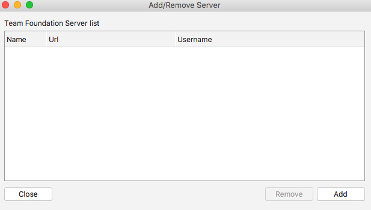

 Choose between VSTS or TFVC server:

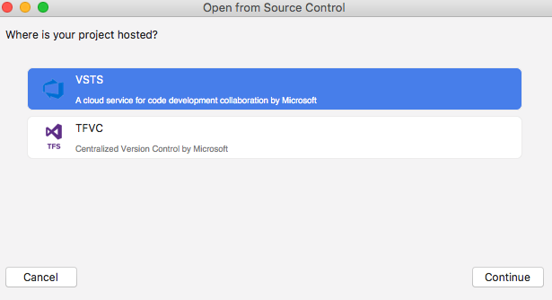

Enter you credentials: 

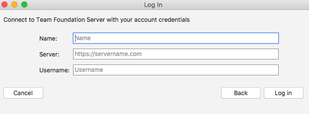

The following authentication modes are supported:
- OAuth
- Basic
- Ntlm

Choose the projects thsat you want to be connected to: 

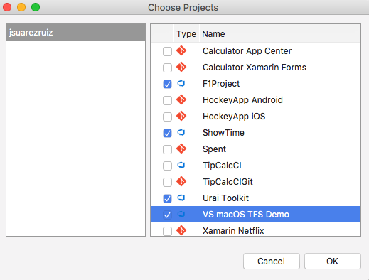

To continue, open "Team Explorer" from Menu > Version Control > Team Foundation Server > Team Explorer. 

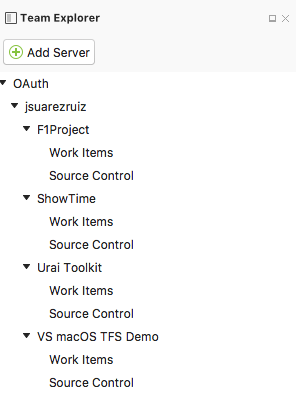

Frome here, you can access to:
- SourceControlExplorer
- WorkItems

Double click on Source Control option to open SourceControlExplorerView. 

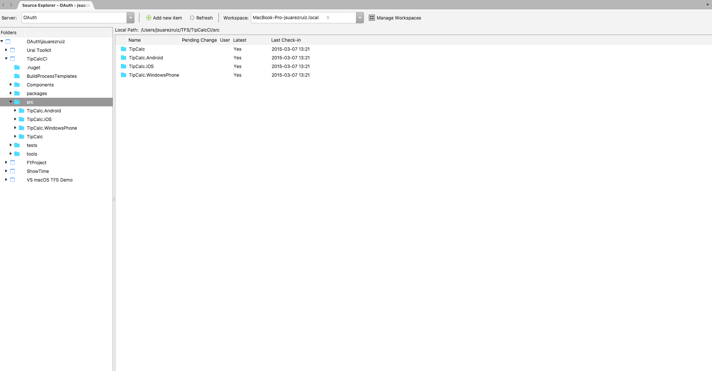

Team Foundation Version Control (TFVC) is a centralized version control system. TFVC lets you do:
- Manage Workspaces (Create, edit or delete).
- Navigate between project structure.
- Map projects.
- Get projects.
- Lock & Unlock.
- Rename.
- Delete.
- Add new file.
- CheckOut.
- CheckIn.

From "Manage" button we can create a manage workspaces. 

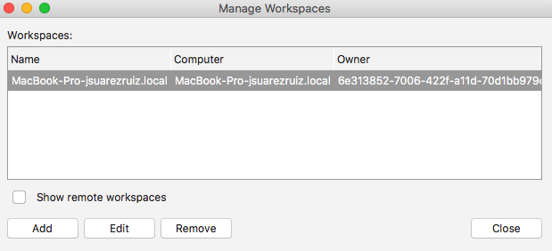

And create a new one:

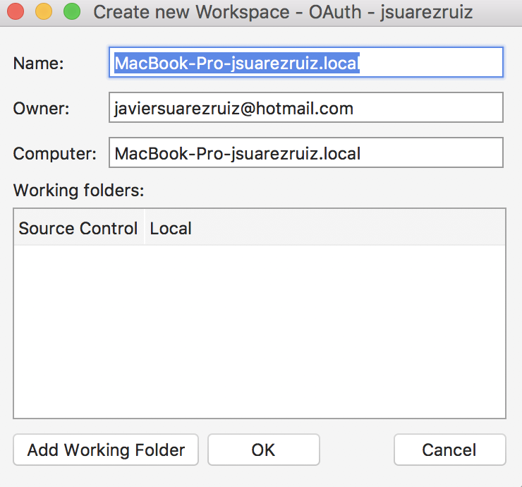

After creating a workspace, the actions are available in a contextual menu.

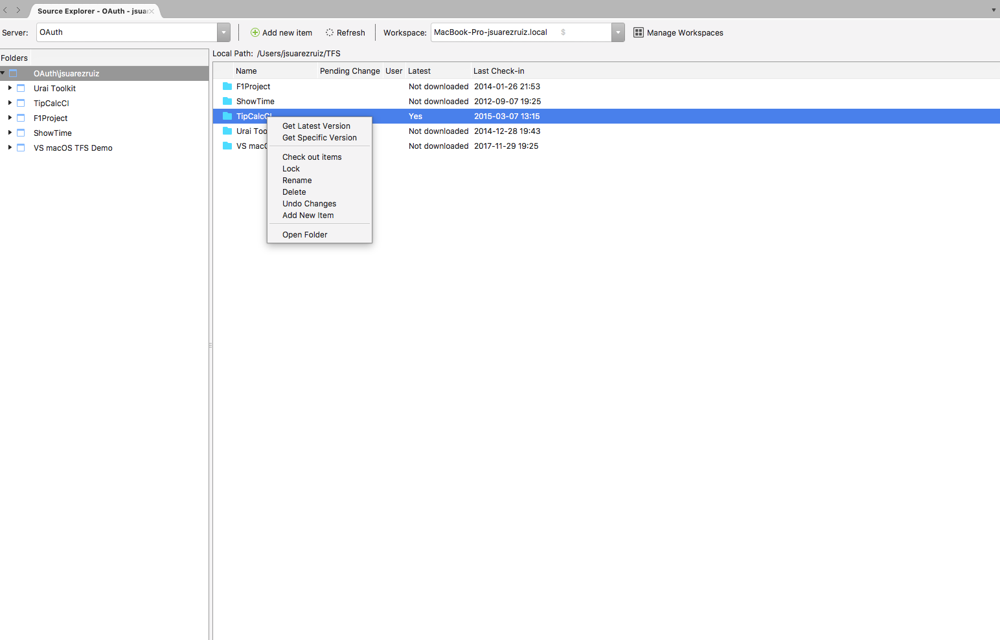

To work witk WorkItems, double click in WorkItems to open WorkItemsView.

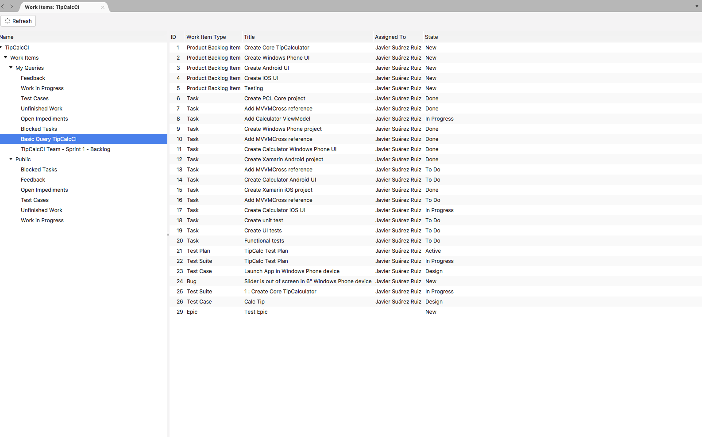

The WorkItems actions are available in a contextual menu.

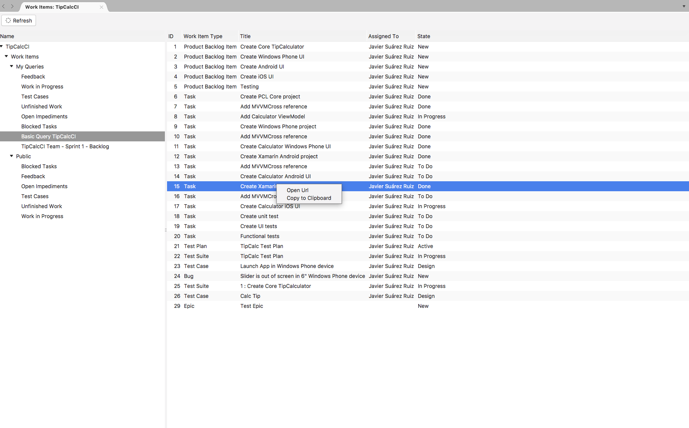

**IMPORTANT:** The user interface design is temporary. Work in progress.

## Distribute

 To pack up the add-in and share with others, go to the assembly output folder to locate the add-in assembly, and call **vstool.exe** utility.

`$ mono /Applications/Visual\ Studio.app/Contents/Resources/lib/monodevelop/bin/vstool.exe setup pack MonoDevelop.VersionControl.TFS.dll`

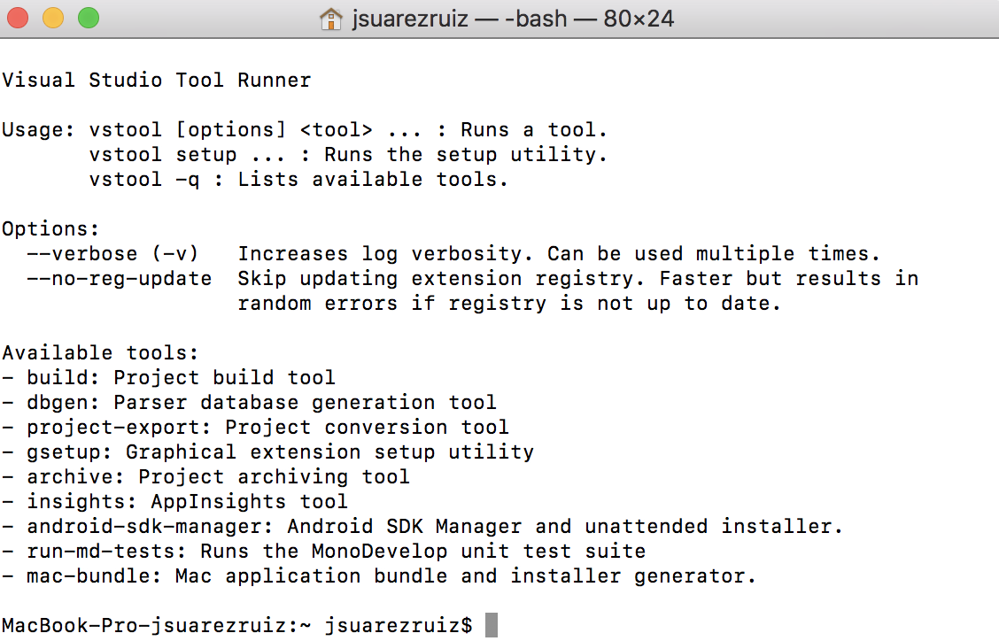

## Thanks

- [https://github.com/Indomitable/monodevelop-tfs-addin](https://github.com/Indomitable/monodevelop-tfs-addin)
- [https://github.com/Microsoft/vsts-auth-samples](https://github.com/Microsoft/vsts-auth-samples)
- [https://github.com/AzureAD/azure-activedirectory-library-for-dotnet](https://github.com/AzureAD/azure-activedirectory-library-for-dotnet)

## Contributing

We take contributions and fixes via Pull Request. Are you interesting?. You can **[contribute](docs/How-Contribute.md)**!.

## Copyright and license

Code and documentation copyright 2018 Microsoft Corp. Code released under the [MIT license](https://opensource.org/licenses/MIT).

## Code of Conduct

This project has adopted the [Microsoft Open Source Code of Conduct](https://opensource.microsoft.com/codeofconduct/). For more information see the [Code of Conduct FAQ](https://opensource.microsoft.com/codeofconduct/faq/) or contact [opencode@microsoft.com](mailto:opencode@microsoft.com) with any additional questions or comments.
